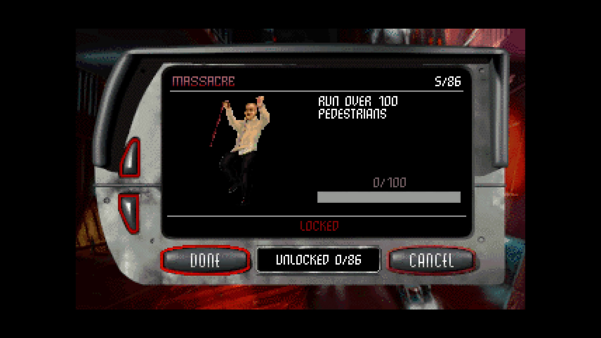

# Dethrace Slop Pack

Modded [Dethrace](https://github.com/dethrace-labs/dethrace) with several tweaks to make the game more to my liking.

No pull requests to upstream because this is heavily AI assisted. The communtiy are (rightly) dubious of AI pull requests and I am not at a level in C that I am comfortable pushing them upstream and pushing the maintenance burden on other people. 

So consider this more of a mod that is just for fun: A wishlist for what I want in the real project with a dirty AI implementation rather than anything that will likely make it into the project itself. If upsteam developers find anything useful, they are of course welcome to merge it. That said, for just playing the game, it improves my experience massively.





## Features - Graphics
- Custom resolution support (3dfx mode only)
- Widescreen support (3dfx mode only)
- Widescreen 2d cockpit support if the 21:9 2d cockpits are present (e.g. MELD mod) they are used for any widescreen resolution
- MSAA support (3dfx mode only)
- Vastly extended draw distance (optional) covering geometry, opponents, pedestrians and powerups
- Sample rate shading (supersampling) support (3dfx mode only)
- Opponent car level of detail always max + view distance increased 10x
- Configureable tyre skid decal limits (blood trails, tyre marks and oil last significantly longer, normally the whole race)
- Tyre skids/blood/oil decals are no longer hovering slightly above the ground

## Features - Gameplay
- Achievements
- Dynamic meld - Content from every game listed in `[Games]` will be melded at the engine level without needing a mod that changes game files. Cars, tracks, etc all get melded so you can have a single campaign with all the content. Tested with Carmageddon, Splat Pack and Xmas Demo.
- When melding, can optionally add the two multiplayer arena tracks into the campaign, you'll get SUMO and COLISEUM as campaign tracks. There is no starting grid since you and opponents use the multiplayer starting positions. No peds, no checkpoints, just last man standing.
- When melding can add the other player character as an opponent (e.g. if you race as Max you can race against Die Anna as an opponent in the campaign)
- Allow configuration of stealworthyness (all cars can be stolen, steal percentage probability, and disabling of rank gate)

## Features - Quality of life
- Loads cutscenes from GAME.GOG/SPLAT.GOG ISO images shipped with the Steam version (and gog version?) rather than requiring them to be extracted to the CUTSCENES directory. It will _just work_ with the Steam/GOG release without manually extracting the cutscenes
- Easier modding, see [Modding](#modding) below

## Bug fixes
- Camera judder fix when car is driving up ramp (rendering only, no physics change, works best with PhysicsPerFrame=1, my biggest annoyance with the game since 1997!)
- Pedestrian spasm fix where peds alternate between two poses every frame and it looks like flickering (This has also bugged me since 1997) 
- 3dfx mode fog causing odd game tint (Dethrace bug)
- Fix z-fighting when draw distance is massively increased (SDL config issue in Dethrace)
- Submersion physics properly applied, can't drive without water physics while under water (Dethrace bug)
- Fix bug where oppponent zone transition sounds e.g. water splash play as if they are coming from the player car (Possibly 1997 game bug?)
- Some textures zoomed in OpenGL mode (Dethrace bug)
- ProcessGetNearPlayer crash fix 
- ReverseSound crash fix when reversing a replay
- TeleportOpponentToNearestLocation - Capped so it doesn't cause a crash in some maps
- Car shadow flickering when car isn't moving (Deathrace bug)
- Sky/horizon black band at some camera angles fixed via GL_DEPTH_CLAMP 

Can all be tuned in dethrace.ini

## Potential future improvements

- Buy button in wreck gallery for purchasing cars Carmageddon 2 style
- Add existing AI as multiplayer mode bots

## Install

Same as upstream dethrace project with one optional addition.

If you are using MeldNetRaces and want to see the arena race cards images, you'll need to install them. 

Copy the `DATA` folder from the zip to the same folder as the executable (or run the game from a folder containg the `DATA` folder, or paste it into your `CARMAGEDDON\DATA` installation folder keeping the directory structure intact).

## Configuation

The following new options are availble under the `[Slop]` section in dethrace.ini

```ini
[Slop]
; Meld all games listed in [Games] section, tracks, cars, etc from all games listed are available in the running instance
; Where assets exist in multiple files (e.g. different loading screens) the first one listed takes priority
Meld = 1 
; When Meld is enabled your chosen character gets both cars at the start of a new game
; Max gets both Eagles, Die Anna gets both Hawks
; When zero you only get the car from the first game listed in [Games]
MeldBothStartingCars = 1
; Meld multiplayer tracks that don't appear as normal races in the campaign
; Unless you have multiplayer focussed mods you'll see both SUMO and COLISEUM 
; as arena races during the single player campaign
MeldNetRaces = 1

; Enable achievements 
Achievements=1

; Custom resolution, aspect ratio is based on this, for 4:3 choose a 4:3 resolution (suggest window mode if you do this since your monitor probably won't support it natively)
Width = 3840
Height = 2160

; Set anti-aliasing level, possible values: 0,2,4,8
Msaa = 8
; Enable Sample Rate Shading - upgrades MSAA to SSAA giving much nicer results at the expense of performance 
SampleRateShading = 1 

; Fixes camera juddering when on slopes (rendering only change, does not affect car physics)
CameraJudderFix = 1

; Set Yon to 1000 (already possible in options.txt) but also increases draw distances of the following
; - Pedestrians
; - 3d objects e.g. traffic lights/road signs
; - Opponents
; - Powerups
ExtendDrawDistance = 1

; Prevent the pedestrian spasm bug that has bugged me since 1997 where a pedestrian will swap between the same two poses every two frames
FixPedSpasm =1

; Allow stealing any car regardless of type (default 0)
StealworthyAllCars = 1
; Probability (0-100) that a car can be stolen when StealworthyAllCars is enabled (default 50)
StealworthyPercentage = 50
; Disable the rank gate that normally prevents stealing cars above your rank (default 0)
StealworthyRankLimitDisable = 1

; Maximum number of skid/blood/oil decals before old ones are recycled (default 100, max 65535)
NumSkids = 65535
```

## Modding

Currently this only works with `Meld=1` but it allows you to quickly add mods in two ways:

1. `./DATA` directory. Place a `DATA` directory beside the executable and any file in there takes precedence over files from the `[Games]` list. You can add new cars, tracks, etc. and they will be picked up automatically, including `DATA/DATA/RACES.TXT` and `DATA/DATA/OPPONENT.TXT` if you want to register new content with the campaign.

2. Mod-Melding. The existing `Meld=1` option supports as many games as you have listed, these don't have to be complete games, they can just contain a single car, track, etc. 

You can add mods as their own entries to load them. This gives a much nicer separation of stock/custom content and makes uninstalling mods a lot easier:

```
[Games]
c1=/path/to/CARMA
splat=/path/to/CARSPLAT
xmasdemo=/path/to/XMASDEMO
mod1=/path/to/my-new-car
mod2=/path/to/my-new-track
```

Note: Mod folders must follow the same structure and contain their own DATA dir 

## Bug reporting

Do not report bugs related to these changes upstream on Deathrace, if you're unsure, try to replicate the issue on the actual deathrace release, if it still happens, report there, if not, report here. 

## Credits

This builds on the incredible [Dethrace](https://github.com/dethrace-labs/dethrace) project 

The DATA dir ships the following:
- Track images for the menu screen for the Sumo and Coliseum tracks by @TRPB


